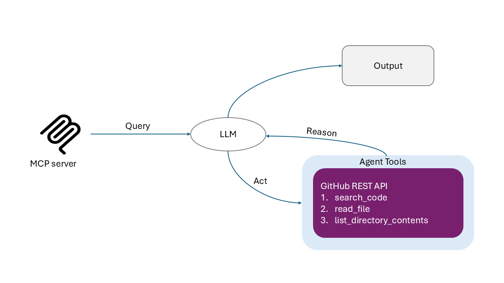

# VitAI - GitHub Repository Analysis Agent

An intelligent ReAct agent that explores GitHub repositories and provides grounded answers based on actual code and repository content.

> **Note**: Configure both `GEMINI_API_KEY` and `GITHUB_TOKEN` in your environment before running the agent.

## Features

### Core Capabilities

- **Intelligent Code Search**: Search across GitHub repositories with precise queries
- **File Content Fetching**: Retrieve and analyze actual file contents via GitHub API
- **Issue/PR Search**: Find relevant discussions, bugs, and feature requests
- **Repository Structure Analysis**: Understand repository layout and organization
- **Vector Store Queries**: Fast semantic search through pre-indexed code embeddings

### ReAct Pattern

VitAI uses the **ReAct (Reasoning + Acting)** pattern:

```
Thought → Action → Observation → Thought → ... → Final Answer
```

The agent autonomously:

1. Reasons about what information it needs
2. Takes actions using available tools
3. Observes the results
4. Continues until it can provide a complete answer

### Available Tools

#### GitHub Agent Tools (Live Search)

1. **query**: ReAct agent that explores GitHub repositories dynamically
2. **search_code**: Find code files using GitHub's code search
3. **get_repo_structure**: Get detailed directory/file tree
4. **get_file_contents**: Fetch actual file contents

#### Vector Store Tools (Semantic Search)

5. **query_vector_store**: Fast semantic search through pre-indexed code chunks
   - Supports filtering by language and file paths
   - Returns relevant code with metadata

## Installation

### Prerequisites

- Python 3.10+
- GitHub Token
- Gemini API Key

### Install `uv`

Windows:

```powershell
powershell -ExecutionPolicy ByPass -c "irm https://astral.sh/uv/install.ps1 | iex"
```

Mac/Linux:

```
curl -LsSf https://astral.sh/uv/install.sh | sh
```

### Setup

```powershell
cd VitAI

# Install dependencies (using uv)
uv sync

# Start MCP Server (with dev inspector)
uv run fastmcp dev main.py

# Start MCP Server (without dev inspector)
uv run fastmcp run main.py
```

### Environment Variables

Create a `.env` file with the following:

```bash
GEMINI_API_KEY=your_gemini_api_key
GITHUB_TOKEN=your_github_token
```

## Architecture



### Agent Flow

```
┌──────────────────────────────────────────────┐
│ Initialize Agent                             │
│  ├─ Load repository structures (cached)      │
│  ├─ Initialize LLM client                    │
│  └─ Initialize GitHub search client          │
└──────────────────────────────────────────────┘
                    ↓
┌──────────────────────────────────────────────┐
│ User Query                                   │
│  ├─ Inject repository context               │
│  ├─ Send to LLM with structure info          │
│  └─ Start ReAct loop                         │
└──────────────────────────────────────────────┘
                    ↓
┌──────────────────────────────────────────────┐
│ ReAct Loop                                   │
│  ├─ Thought: Reason about next step          │
│  ├─ Action: Use tool with precise query      │
│  │   (Informed by repository structure)      │
│  ├─ Observation: Process results             │
│  └─ Repeat or provide Final Answer           │
└──────────────────────────────────────────────┘
```
